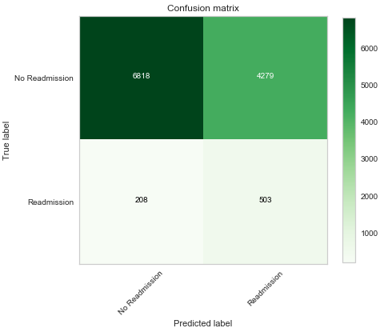

# Using natural language processing with word embeddings and topic modeling on clinical notes to predict hospital readmission

30-day hospital readmissions have been targeted as a key metric of patient care. In 2012, the Affordable Care Act initiated the Hospital Readmission Reduction Program (HRRP) to incentivize improved patient outcomes by financially penalizing hospitals with excessive readmission rates. According to the American Hospital Association, in the first five years of the HRRP, hospitals experienced $1.9 billion in penalties. 

This project uses 283,208 clinical notes (nursing and discharge summary) on 35,779 patient admissions from the MIMIC-III database. Various natural language processing models were assessed in their ability to predict all-cause 30-day readmission for all patients (excluding neonates). While a Random Forest model with a bag-of-words approach proved to be the best fit with a ROC-AUC of 0.7076, a preliminary skip-gram word embedding model using Word2Vec with Latent Dirichlet Allocation (LDA)  and logistic regression showed promising results with a ROC-AUC of 0.7078. Future models could focus on more effective classification algorithms and hyperparameter tuning.

**Data Source**

[MIMIC-III v1.4](https://mimic.physionet.org/)

Table of Contents
------------

1. [Predictive Modeling Notebook](Predictive_Modeling.ipynb): this notebook runs through the various models that were attempted with outputs of their respective ROC curve and confusion matrix.
2. [Slide Deck](Predicting_readmission_slidedeck.pdf): used to present the findings from exploration and modeling
3. [notebooks](notebooks): these are exploratory notebooks used to show the model building process
   1. [DataPrep](notebooks/0.1-TheeChris-DataPrep.ipynb): collecting and cleaning data
   2. [DataExploration](notebooks/1.1-TheeChris-DataExploration.ipynb): examining trends in the data
   3. [Logistic Regression](notebooks/2.1-TheeChris-ModelLogisticReg.ipynb): bag-of-words models using logistic regressions
   4. [Word2Vec](notebooks/2.2_TheeChris_ModelWord2Vec.ipynb): word embeddings models
   5. [ULMFiT](notebooks/2.3_TheeChris_ModelULMFiT.ipynb): pre-trained language model
   6. [Random Forest](notebooks/2.4_TheeChris_ModelRandomForest.ipynb): bag-of-words models using random forest
   7. [SVM](notebooks/2.5_TheeChris_ModelSVM.ipynb): bag-of-words models using support vector machine
4. [reports](reports)
   1. [Figures](reports/figures): all saved plot outputs 
   2. [Final Report](reports/Capstone_2_Report.pdf): a summary of the project process and results
   3. [Milestone Report 1](reports/Capstone2_Milestone_Report.pdf): a summary of data preparation and exploration
   4. [Milestone Report 2](reports/Capstone2_Milestone_Report_2.pdf): a summary of the initial logistic regression model with over- and under-sampling
5. [src](src): source code for modules used in the project

**Latent Dirichlet Allocation Topic Modelling**

**Random Forest Bag-of-Words ROC Curve and Confusion Matrix**

